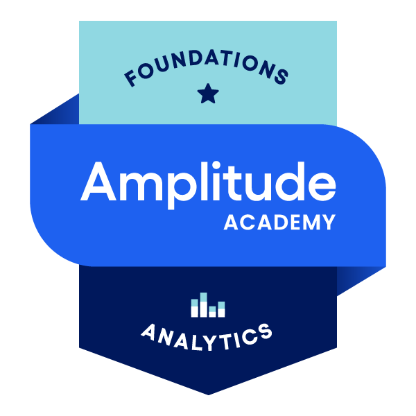
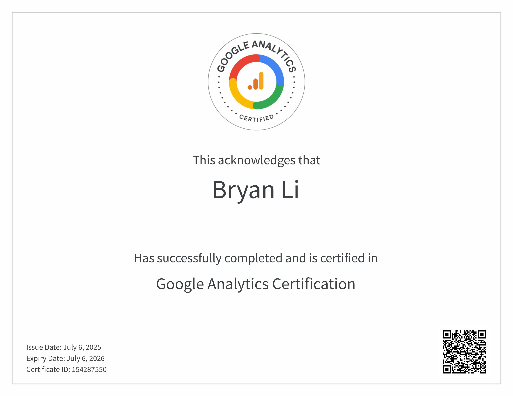

&fontColor=FFFFFF&fontAlignY=36&descAlignY=60&fontSize=85&descSize=18)

<!-- ============================================================================================================================== -->
<!-- ============================================================================================================================== -->
<!-- ======== SOCIAL ICONS + PROFILE VIEW COUNTER ======== -->
<!-- ============================================================================================================================== -->
<!-- ============================================================================================================================== -->

    
&nbsp;

  

    
🌐 MY OTHER SOCIALS

    

 
 

    
    
    

<!-- ============================================================================================================================== -->
<!-- ============================================================================================================================== -->
<!-- ============================================================================================================================== -->

<!-- ============================================================================================================================== -->
<!-- ============================================================================================================================== -->
<!-- ======== PRIMARY SKILLS SECTION (WITHOUT DETAILS & MISSING SOME SKILLS) ======== -->
<!-- ============================================================================================================================== -->
<!-- ============================================================================================================================== -->
### 🛠 MY SKILLSET

<h4>👨‍💻 Web Development</h4>

<h4>⚙️ Other / General Purpose Technologies</h4>

<h4>🖥️ Services, Platforms & Softwares</h4>

<!-- ============================================================================================================================== -->
<!-- ============================================================================================================================== -->
<!-- ============================================================================================================================== -->

<!--

  

      
Services, Platforms & Softwares Details & Additional Technologies

      <h3 align="left">Services, Platforms & Softwares</h3>
  
  | 📷 Icon | 📄 Name | 🗃️ My Experience | 🗂️ Projects Used In | Last Used |
  | :----: | :----: | :----------: | :------------: | :-----: |
  | |  | | |
  | |  | | |
  | |  | | |
  | |  | | |
  | |  | | |
  | |  | | |
  | |  | | |
  | |  | | |
  | |  | | |
  | |  | | |
  | |  | | |
  | |  | | |
  | |  | | |
  | |  | | |
  | | | | |
  | |  | | |
  | |  | | |
  | |  | | |
  | |  | | |
  | |  | | |
  | |  | | |
  | |  | | |
  | |  | | |
  | |  | | |
  | |  | | |
  | |  | | |
  | |  | | |
  | |  | | |
  | |  | | |
  | |  | | |
  | |  | | |
  | |  | | |
  | |  | | |
  | |  | | |
  | |  | | |
  | |  | | |
  | | | | |

 -->

<!--  -->

### 🗺️ PLANS & GOALS
- 🐉 Continue to further develop my React & NextJS skills
- 🚀 Expand my horizons. Improve my skills in less used technologies: MongoDB, Vue, Svelte, and Angular
- 🏗️ Build more Frontend & Full-Stack projects
- 🧪 Experiment with new libraries & tools
- 📰 Write interesting/helpful articles on Medium
- 📊 Practice Data Mining, Data Analytics, Machine Learning & AI development skills
- 🔎 Improve my SEO, Accessibility, and SSR skills
- 🐐 Code more Frontend Mentor projects & provide help more people on the platform

 

<!-- ============================================================================================================================== -->
<!-- ============================================================================================================================== -->
<!-- ======== BADGES, PINS, CERTIFICATES, CREDENTIALS, ETC SECTION ======== -->
<!-- ============================================================================================================================== -->
<!-- ============================================================================================================================== -->

  
 🔍 Click to see more: Certifications, Credentials, Badges & Pins 🎖️🏆 

   

  
   
   
<!--START_SECTION:badges-->

<!--END_SECTION:badges-->
  

    Click <a href="https://www.credly.com/users/bryan-li712/badges">here</a> to see the rest of my badges on Credly. Workflow for automated readme badge updates sourced from <a href="https://github.com/pemtajo/badge-readme">here</a>.
  
    

 
<!-- ============================================================================================================================== -->
<!-- ============================================================================================================================== -->
<!-- ============================================================================================================================== -->

  
🔍 Extra GitHub Stats 📊

   
  

    
    
    
    
     
    
    <picture>
      <source media="(prefers-color-scheme: dark)" srcset="https://github.com/zy8712/zy8712/raw/output/github-snake-dark.svg">
      <source media="(prefers-color-scheme: light)" srcset="https://github.com/zy8712/zy8712/raw/output/github-snake.svg">
      
    </picture>
    
    <!-- 
    

      <a href="https://github.com/Zy8712">
        <!-- 
        
      </a>
    

    -->
  

 

  
🔍 Extra LeetCode Stats 📈

   
  

    
     
  

  

    
  

  

    
  

<!--

    
P

     
    

-->

